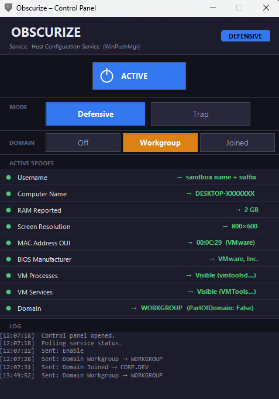
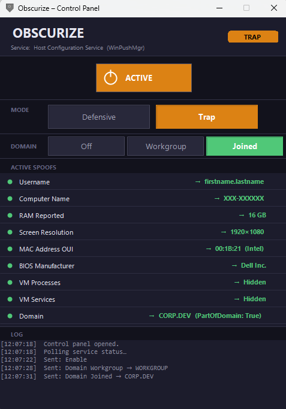

# Obscurize

A defensive deception tool that uses userland API hooking to manipulate what
a running process perceives about the host environment. Designed for two
distinct threat scenarios:

- **Defensive Mode** — makes a real host look like a sandboxed VM so that
  malware performing anti-analysis checks detects a controlled environment
  and self-terminates before executing its payload.
- **Trap Mode** — makes a honeypot VM look like genuine physical hardware so
  that malware passes its anti-analysis checks and executes fully, enabling
  observation and threat intelligence collection.

Spoofing is applied at runtime via an injected DLL — no system files are
modified, no kernel driver is required. All changes are reversed when the
service stops.

> **License:** source-available under the
> [PolyForm Shield License 1.0.0](LICENSE) — free to use and modify to
> defend your own systems or your organization's, at any scale; a
> [commercial license](COMMERCIAL-LICENSE.md) is required to ship it inside
> a product you provide to others. Releases through `1.9.0_Release` remain
> MIT-licensed. See [License](#license).

<table>
<tr>
<td width="50%" align="center"><strong>Defensive Mode</strong><br/><sub>real host presented as a sandbox VM</sub></td>
<td width="50%" align="center"><strong>Trap Mode</strong><br/><sub>honeypot VM presented as real hardware</sub></td>
</tr>
<tr>
<td width="50%"></td>
<td width="50%"></td>
</tr>
</table>

---

## Threat Model & Background

Modern malware routinely performs environment checks before executing its
payload. Two documented campaigns from Securonix Threat Research illustrate
the scope of this problem:

**DEAD#VAX** ([Securonix, 2026](https://www.securonix.com/blog/deadvax-threat-research-security-advisory/))
inspects the current username, available RAM, MAC address OUI, WMI BIOS
strings, and the presence of VMware / VirtualBox registry keys and artifact
files before proceeding. If the host looks like a sandbox, the malware exits
silently.

**FAUX ELEVATE** ([Securonix, 2026](https://www.securonix.com/blog/faux-elevate-threat-actors-crypto-miners-and-infostealers/))
introduced a more targeted pre-execution check: `Win32_ComputerSystem.PartOfDomain`.
The malware queries whether the host is joined to a corporate domain before
delivering its full payload chain. On standalone home systems or
non-domain-joined machines, it delivers only a UAC elevation loop and withholds
the primary payload entirely. This deliberate targeting of domain-joined machines
confirms a campaign aimed specifically at corporate and enterprise environments,
where credentials and internal network access carry higher value.

Obscurize exploits this behaviour in two directions:

| Scenario | Goal | What Obscurize does |
|---|---|---|
| Production host | Blend into malware's "don't execute" category | Present all the hallmarks of a sandbox (VM BIOS, low RAM, analysis username, VMware MAC OUI) |
| Honeypot VM | Blend into malware's "safe to execute" category | Strip all VM indicators, present real-hardware profile (Dell BIOS, 16 GB RAM, normal username, Intel MAC OUI) |

---

## Architecture

```
+------------------------------------------------------------------+
|  ObscurizeGUI.exe  (.NET 4.8 WinForms, system tray)             |
|  * Status poller pings control pipe every 2 s                    |
|  * Tray icon: blue shield (Defensive) / amber (Trap) / grey      |
|  * Main window: live spoof-value display + event log             |
+------------------------------+-----------------------------------+
                               |  \\.\pipe\ObscurizeCtrl  (named pipe, DWORD codes)
+------------------------------v-----------------------------------+
|  ObscurizeService.exe  (Windows Service, LocalSystem, x64)       |
|  * Monitors new processes via EnumProcesses polling              |
|  * Synchronous pre-injection for wmic.exe (OBS_CTRL_INJECT_PID) |
|  * Reflectively injects Agent DLL into every user process        |
|  * Manages persistent registry / filesystem artefacts            |
|  * Installs system-wide PowerShell profile.ps1 (WMI hook)        |
|  * Config: HKLM\...\CurrentVersion\DeviceCache (OPSEC-hidden)   |
+------------------------------+-----------------------------------+
                               |  Reflective DLL injection (r77api InjectDll)
+------------------------------v-----------------------------------+
|  ObscurizeAgent32/64.dll  (injected into every user process)     |
|  * Microsoft Detours hooks on Win32 + NT APIs (26 hooks total)   |
|  * Reads config from registry every 1 s                          |
|  * Hooks are installed/removed without restarting the process    |
+------------------------------------------------------------------+
```

### Components

| Component | Language | Output |
|---|---|---|
| **ObscurizeAgent** | C (Win32) | `ObscurizeAgent32.dll` + `ObscurizeAgent64.dll` |
| **ObscurizeService** | C (Win32) | `ObscurizeService.exe` |
| **ObscurizeGUI** | C# / WinForms (.NET 4.8) | `ObscurizeGUI.exe` |
| **ObscurizeShared** | C header + C# file | Shared constants (no separate binary) |

---

## Spoofing Coverage

### Defensive Mode (appear as a VM / sandbox)

| Check intercepted | Method | Spoofed value |
|---|---|---|
| `GetUserNameW/A` | API hook | Random sandbox username — base picked from `{admin, user, sandbox, malware, test}` with a 6-char mixed-case alphanumeric suffix (e.g. `admin4Kj9Pq`, `malwareXz7Wm2`). Unique per injected process. |
| `GetComputerNameExW/A` | API hook | Random `DESKTOP-XXXXXXX` — the dominant naming pattern in public sandbox systems (Any.run, Joe Sandbox, Cuckoo) and the Windows 10/11 consumer default. 7-char consonant-alphanumeric suffix. Unique per injected process. |
| `GlobalMemoryStatusEx` | API hook | 2 048 MB physical RAM |
| `EnumDisplaySettingsW` | API hook | 800 x 600 resolution |
| `GetAdaptersAddresses` / `GetAdaptersInfo` | API hook | MAC OUI `00:0C:29` (VMware) |
| `NtQueryValueKey` (BIOS registry key) | NT hook | VMware BIOS strings (manufacturer, product, serial, UUID) |
| `GetSystemFirmwareTable` (raw SMBIOS) | API hook | VMware manufacturer / product in RSMB table |
| `wmic path Win32_BIOS get SerialNumber` | Pre-injection (`CREATE_SUSPENDED` + `NtQueryValueKey` hook) | VMware BIOS serial / UUID |
| `HKLM\HARDWARE\DESCRIPTION\System\BIOS` | Registry write | VMware manufacturer / product |
| `HKLM\SOFTWARE\VMware Inc.\VMware Tools` | Registry write | Created (presence check) |
| `HKLM\SOFTWARE\Oracle\VirtualBox Guest Additions` | Registry write | Created (presence check) |
| `%TEMP%\mapping.csv`, `VBE_marker.tmp` | Filesystem | **Not** created (absence triggers DEADVAX abort) |
| PowerShell `Get-WmiObject` / `Get-CimInstance` | profile.ps1 hook | Returns VMware hardware strings, 800x600 resolution, VMware MAC OUI + dynamic `PartOfDomain` / `Domain` from registry |
| `CreateProcessW/A` (PowerShell spawn) | API hook | Strips `-NoProfile` flag so profile.ps1 always loads |
| `CreateProcessW/A` (wmic.exe spawn) | API hook | Creates wmic.exe suspended; service injects Agent before first instruction runs |
| `NetGetJoinInformation` (`Win32_ComputerSystem.PartOfDomain`) | API hook | `WORKGROUP` / `PartOfDomain: False` |

### Trap Mode (appear as real hardware)

| Check intercepted | Method | Spoofed value |
|---|---|---|
| `GetUserNameW/A` | API hook | Session-pinned corporate username in `firstname.lastname` format (e.g. `joseph.johnson`, `sarah.taylor`). Generated once by the service when Trap mode activates and written to the `UserSID` registry value; every injected process returns the same identity for the duration of the session. A pre-set `UserSID` value is respected as a manual persona override. |
| `GetComputerNameExW/A` | API hook | Session-pinned corporate computer name in `XXX-XXXXXX` format — 3-letter org prefix + 6 consonant-alphanumeric chars (e.g. `DZC-KCTV3J`, `BKR-F3M7KP`). Matches common Active Directory naming conventions; explicitly avoids the `DESKTOP-` prefix that malware now flags as a sandbox indicator. Generated once at Trap activation and written to `HostBinding`; all injected processes return the same name. A pre-set `HostBinding` is respected as a manual persona override. |
| `GlobalMemoryStatusEx` | API hook | 16 384 MB physical RAM |
| `EnumDisplaySettingsW` | API hook | 1920 x 1080 resolution |
| `GetAdaptersAddresses` / `GetAdaptersInfo` | API hook | MAC OUI `00:1B:21` (Intel) |
| `NtQueryValueKey` (BIOS registry key) | NT hook | Dell BIOS strings (manufacturer, product, serial, UUID) |
| `GetSystemFirmwareTable` (raw SMBIOS) | API hook | Dell manufacturer / product in RSMB table |
| `wmic path Win32_BIOS get SerialNumber` | Pre-injection (`CREATE_SUSPENDED`) + WriteConsoleW hook | Dell BIOS serial string |
| `EnumServicesStatusExW/A` / `EnumServicesStatusW/A` | API hook | VM service names filtered out |
| `NtQuerySystemInformation` | NT hook | VM process names filtered out |
| `NtEnumerateKey` / `NtQueryKey` | NT hook | VM vendor registry subkeys filtered from `HKLM\SOFTWARE`; Obscurize config key hidden from `CurrentVersion` enumeration |
| VMware / VirtualBox registry keys | Registry delete | Removed |
| `%TEMP%\mapping.csv`, `VBE_marker.tmp` | Filesystem | Created (presence satisfies DEADVAX check) |
| PowerShell `Get-WmiObject` / `Get-CimInstance` | profile.ps1 hook | Returns spoofed Dell hardware strings, 1920x1080 resolution, Intel MAC OUI + dynamic `PartOfDomain` / `Domain` from registry |
| `CreateProcessW/A` (PowerShell spawn) | API hook | Strips `-NoProfile` flag so profile.ps1 always loads |
| `CreateProcessW/A` (wmic.exe spawn) | API hook | Creates wmic.exe suspended; service injects Agent before first instruction runs |
| `systeminfo.exe` stdout | WriteConsoleW hook | Replaces VMware strings with Dell strings in terminal output |
| `wmic.exe` stdout | WriteConsoleW hook | Replaces VMware BIOS serial / UUID strings with Dell strings in terminal output |
| `NetGetJoinInformation` (`Win32_ComputerSystem.PartOfDomain`) | API hook | `CORP.DEV` / `PartOfDomain: True` (when Domain toggle is ON) |

#### PowerShell WMI Spoofing Detail

When a process spawns PowerShell with `-NoProfile` (a common TTP to bypass
profile-based hooks), the `CreateProcessW/A` hook silently strips the flag
before the child process starts. The system-wide
`C:\Windows\System32\WindowsPowerShell\v1.0\profile.ps1` installed by the
Service then intercepts `Get-WmiObject Win32_ComputerSystem`,
`Get-WmiObject Win32_BIOS`, and their `Get-CimInstance` equivalents,
returning Dell hardware strings instead of VMware values.

#### systeminfo.exe Stdout Patching Detail

`systeminfo.exe` is a common post-exploitation enumeration tool used by human
attackers after initial access. When the Agent is injected into a
`systeminfo.exe` process (detected at DLL load time by process name), it
hooks `WriteFile`, `WriteConsoleA`, and `WriteConsoleW` on `kernelbase.dll`
(the actual implementation, not the kernel32 forwarding stubs) to intercept
stdout writes. The patch runs only in Trap mode and applies two kinds of
replacement before output reaches the terminal.

**Value-based patterns** (search for a known VMware string, replace it):

| Original string | Replacement |
|---|---|
| `VMware, Inc. VMW...` (BIOS version line) | `Dell Inc. 1.22.0, 04/14/2023` |
| `VMware20,1` (system model) | `Precision 5560` |
| `VMware, Inc.` (manufacturer) | `Dell Inc.` |

**Label-anchored fields** (the real value is host-specific and not known in
advance, so the patch matches the field *label* at line start, preserves the
label and its column padding, and overwrites the value to end-of-line):

| Field label | Replacement source |
|---|---|
| `Host Name:` | Session-pinned spoofed computer name (`HostBinding`), uppercased |
| `Processor(s):` → each `[0N]:` entry | `Intel64 Family 6 Model 140 Stepping 1 GenuineIntel ~3000 Mhz` (systeminfo-format, not the marketing name) |
| `Total Physical Memory:` | Spoofed memory (`16,384 MB`) |
| `Domain:` | Spoofed domain (`WORKGROUP` / `CORP.DEV`); left untouched when the domain hook is off |

Processor entries are only rewritten after the `Processor(s):` label has been
seen and before the next column-0 field, since the same `[0N]:` prefix is also
used by `Network Card(s):` and `Hotfix(es):`. Each entry keeps its own index and
only the model text is replaced. The processor **count** line is deliberately
left alone: a multi-socket host reports N identical Trap CPUs, which is
self-consistent and irrelevant to enumeration.

**Implementation note — write chunking.** `systeminfo` does not emit its report
in one call. A single line's label, its column padding, and its value routinely
arrive in *separate* `WriteConsoleW` / `WriteFile` calls. The label-anchored
replacements therefore carry state across calls: a matched label sets a "pending
field", and the value is swapped whenever it arrives. For the same reason the
`[0N]:` entry match must **not** be gated on being at the start of a line — the
indentation frequently arrives as its own write, so a line-start test fails.
Both the ANSI and wide patch paths implement this identically.

The hook only activates in `systeminfo.exe` and `wmic.exe` to avoid overhead in
all other processes.

#### wmic.exe Serial Number Patching Detail

`wmic path Win32_BIOS get SerialNumber` (and equivalent UUID / manufacturer
queries) is a common malware TTP for detecting VM environments via SMBIOS
Type 1 data. The challenge is timing: wmic.exe resolves its WMI query and
terminates in under 200 ms. The service's 100 ms `EnumProcesses` poll
typically fires ~80 ms after wmic.exe starts — after the query has already
completed — leaving a window where the real BIOS serial number is returned.

To close this gap, the `CreateProcessW/A` hook detects when the spawning
process is launching `wmic.exe` and automatically adds `CREATE_SUSPENDED` to
the creation flags before delegating to the real `CreateProcessW`. It then
sends an `OBS_CTRL_INJECT_PID` message to the service pipe (a two-DWORD
request: control code + PID), waits for the service to confirm injection, and
only then calls `ResumeThread`. The round-trip completes in under 20 ms,
ensuring the Agent and its `NtQueryValueKey` hook are fully installed before
wmic.exe executes a single instruction.

The `WriteFile` / `WriteConsoleA` / `WriteConsoleW` hooks are also installed
in the wmic.exe process (same as `systeminfo.exe`) to patch any VMware strings
in stdout before they reach the terminal, providing a second interception layer
for cases where the SMBIOS data flows through a code path not covered by
`NtQueryValueKey`.

#### Service Enumeration Detail

There are two separate, similarly-named Win32 APIs for listing Windows
services: `EnumServicesStatusEx` (the newer "Ex" variant, which supports
group-name filtering and returns process IDs) and the older, plain
`EnumServicesStatus`. Native callers — Task Manager's Services tab,
`tasklist.exe` — reach the "Ex" family. .NET's
`System.ServiceProcess.ServiceController.GetServices()` — and therefore
PowerShell's `Get-Service` cmdlet — calls the older, plain
`EnumServicesStatusW`. Hooking only the "Ex" family (the original
implementation) left `Get-Service` completely unfiltered in Trap mode even
though every native enumeration path was correctly hidden. Both families are
now hooked, covering native and managed callers alike.

#### whoami.exe Username Detail

Like service enumeration, the current username is a single conceptual fact that
Windows exposes through several independent mechanisms — and `whoami.exe`
imports three of them:

| API | DLL | Used by |
|---|---|---|
| `GetUserNameW/A` | advapi32 | *not called by whoami at all* |
| `GetUserNameExW` | secur32 | only the `/upn` and `/fqdn` switches |
| `GetTokenInformation` → `LookupAccountSidW` | advapi32 | **plain `whoami` and `whoami /all`** |

Plain `whoami` reads its access token's user SID and resolves it to a
`DOMAIN\Username` pair via `LookupAccountSidW`. It never touches `GetUserNameW`,
so the original hook never fired. Hooking `GetUserNameExW` did not help either —
that is a real sibling, but it is only on the `/upn` and `/fqdn` paths. This was
confirmed empirically: with a probe on `GetUserNameExW`, `whoami.exe` was
verifiably injected and the hook armed, yet the probe never fired.

`LookupAccountSidW` is now hooked, with two deliberate constraints:

- **Scoped to the current user's SID.** The hook caches the process token's user
  SID and rewrites the result only for that exact SID; group SIDs, other users,
  and well-known SIDs pass straight through. The token still carries the real
  SID — only the name it resolves to is rewritten.
- **Scoped to `whoami.exe`** (`g_IsWhoami`, same pattern as the stdout hooks).
  `LookupAccountSidW` is used broadly by the security and COM stacks; spoofing it
  process-wide breaks WMI connection setup and hangs any WMI client, including
  `systeminfo.exe`.

The returned domain component is the session-pinned spoof computer name (or the
NetBIOS form of the spoof domain when Domain is ON), so `whoami` reads
consistently with the Host Name and Domain reported by `systeminfo`.
`GetUserNameExW` remains hooked for the `NameSamCompatible` format so other
tools reaching for *that* sibling are also covered, with all other
`EXTENDED_NAME_FORMAT` values passed through to protect Kerberos / SSO paths.

**Known limitation:** `whoami /all` prints the spoofed name beside the *real*
SID. Obscurize rewrites SID→name resolution, not the token's SID itself.

This is the same lesson as `Get-Service`, twice over: hooking one API for a fact
does not cover the fact — it covers that one code path. Here the first "obvious"
sibling was also the wrong one, and only instrumentation showed which mechanism
the tool actually used.

#### Domain Join Spoofing Detail

Inspired by the [FAUX ELEVATE campaign](https://www.securonix.com/blog/faux-elevate-threat-actors-crypto-miners-and-infostealers/),
which gates full payload delivery on `Win32_ComputerSystem.PartOfDomain` being
`True`, Obscurize uses a two-layer approach to spoof domain join state:

**Layer 1 - PowerShell WMI (profile.ps1):** `Get-WmiObject Win32_ComputerSystem`
and `Get-CimInstance Win32_ComputerSystem` execute inside `WmiPrvSE.exe`, not
the calling PowerShell process. API hooks in the PowerShell process never fire
for WMI-sourced data. The system-wide `profile.ps1` intercepts these calls and
reads `NetworkScope` from
`HKLM\SOFTWARE\Microsoft\Windows NT\CurrentVersion\DeviceCache` dynamically at
query execution time, setting `PartOfDomain` and `Domain` on the returned
object without requiring a profile regeneration when the mode changes.
When `NetworkScope=0` (Off), the profile leaves the real WMI values untouched.

**Layer 2 - Direct Win32 callers (NetGetJoinInformation hook):** Malware that
calls `NetGetJoinInformation` in `netapi32.dll` directly (outside of WMI) is
intercepted by the Agent hook installed in that process.

The Domain selector is independent of Defensive / Trap mode and is available
in both. It is controlled from a three-button selector in the GUI control
panel and persisted to the `NetworkScope` registry value.

| Domain mode | `NetworkScope` value | `PartOfDomain` | `Domain` |
|---|---|---|---|
| **Off** (default) | `0` | Real value (hook inactive) | Real value |
| **Workgroup** | `1` | `False` | `WORKGROUP` |
| **Joined** | `2` | `True` | `CORP.DEV` |

**Off mode** disables the hook entirely so the real domain join state is
returned. This is the recommended setting when running Obscurize on a
domain-joined machine where you need to reach network shares, printers,
and other domain resources — spoofing `PartOfDomain: False` would break
Kerberos ticket acquisition and UNC path resolution.

The domain name is configurable via the `NetworkDomain` registry value.

---

## API Hooks Reference

The Agent installs up to 26 Detours hooks per process — 22 in every injected
process, plus the WriteFile / WriteConsoleA / WriteConsoleW stdout hooks (only
in `systeminfo.exe` and `wmic.exe`) and `LookupAccountSidW` (only in
`whoami.exe`). The process-scoped hooks are gated because they touch APIs the
rest of the system depends on.

| Hook | DLL | Defensive | Trap |
|---|---|---|---|
| `GetUserNameW` | advapi32 | Random sandbox username (e.g. `sandbox3Rp8Kn`) | Session-pinned `firstname.lastname` (e.g. `joseph.johnson`) from `UserSID` registry value |
| `GetUserNameA` | advapi32 | Random sandbox username (e.g. `sandbox3Rp8Kn`) | Session-pinned `firstname.lastname` from `UserSID` registry value |
| `GetUserNameExW` | secur32 | `COMPUTERNAME\username` for `NameSamCompatible` callers (per-process identity) | Session-pinned `HOSTNAME\username`, or `DOMAIN\username` when Domain ON. Covers `whoami /upn` and `/fqdn`, not plain `whoami` |
| `LookupAccountSidW` | advapi32 | `COMPUTERNAME\username` for the current-user SID only | Session-pinned `HOSTNAME\username` — this is what plain `whoami` and `whoami /all` use. **Only hooked in `whoami.exe`** |
| `GetComputerNameExW` | kernel32 | Random `DESKTOP-XXXXXXX` (sandbox/consumer pattern) | Session-pinned `XXX-XXXXXX` corporate name (e.g. `DZC-KCTV3J`) from `HostBinding` registry value |
| `GetComputerNameExA` | kernel32 | Random `DESKTOP-XXXXXXX` (sandbox/consumer pattern) | Session-pinned `XXX-XXXXXX` corporate name from `HostBinding` registry value |
| `GlobalMemoryStatusEx` | kernel32 | Reports 2 048 MB RAM | Reports 16 384 MB RAM |
| `EnumDisplaySettingsW` | user32 | Reports 800x600 | Reports 1920x1080 |
| `GetSystemMetrics` | user32 | Reports 800x600 (SM_CXSCREEN/SM_CYSCREEN) | Reports 1920x1080 |
| `GetAdaptersAddresses` | iphlpapi | OUI `00:0C:29` (VMware) | OUI `00:1B:21` (Intel) |
| `GetAdaptersInfo` | iphlpapi | OUI `00:0C:29` (VMware) | OUI `00:1B:21` (Intel) |
| `EnumServicesStatusExW` | advapi32 | Pass-through | Filters VM service names |
| `EnumServicesStatusExA` | advapi32 | Pass-through | Filters VM service names |
| `EnumServicesStatusW` | advapi32 | Pass-through | Filters VM service names |
| `EnumServicesStatusA` | advapi32 | Pass-through | Filters VM service names |
| `NtQuerySystemInformation` | ntdll | Pass-through | Filters VM process names |
| `NtEnumerateKey` | ntdll | Hides Obscurize config key from `CurrentVersion` enumeration | Hides config key from `CurrentVersion` enumeration + filters VM vendor subkeys from `HKLM\SOFTWARE` |
| `NtQueryKey` | ntdll | Corrects SubKeys count after config key concealment | Corrects SubKeys count after config key concealment and VM vendor key filtering |
| `NtQueryValueKey` | ntdll | VMware BIOS strings | Dell BIOS strings |
| `GetSystemFirmwareTable` | kernel32 | VMware strings in RSMB table | Dell strings in RSMB table |
| `CreateProcessW` | kernel32 | Strips `-NoProfile` from PS spawns; creates wmic.exe suspended for pre-injection | Strips `-NoProfile` from PS spawns; creates wmic.exe suspended for pre-injection |
| `CreateProcessA` | kernel32 | Strips `-NoProfile` from PS spawns; creates wmic.exe suspended for pre-injection | Strips `-NoProfile` from PS spawns; creates wmic.exe suspended for pre-injection |
| `WriteFile` | kernelbase | -- | Patches systeminfo.exe (BIOS/model/mfg + Host Name, Processor, memory, domain) and wmic.exe stdout |
| `WriteConsoleA` | kernelbase | -- | Patches systeminfo.exe (BIOS/model/mfg + Host Name, Processor, memory, domain) and wmic.exe stdout |
| `WriteConsoleW` | kernelbase | -- | Same as WriteConsoleA, via the ConPTY / Windows Terminal path |
| `NetGetJoinInformation` | netapi32 | `WORKGROUP` / `PartOfDomain: False` | `CORP.DEV` / `PartOfDomain: True` (when Domain ON) |

---

## Design Decisions

**Pure userland (Ring 3)** — No kernel driver is required. Hooks are installed
via Microsoft Detours (statically linked), the same library used by r77-rootkit.
This avoids driver signing requirements entirely for v1.

**Reflective injection** — The Agent DLL is embedded as an RCDATA resource
inside the Service EXE (IDs 101 and 102 for x86/x64). No Agent DLL file ever
appears on disk. Injection uses r77api's `InjectDll()` path via
`NtCreateThreadEx`.

**Process-wide coverage** — The Service's process listener polls `EnumProcesses`
every 100 ms and injects the Agent into any newly-spawned process, ensuring
malware is hooked from the moment it starts.

**Live config** — Each Agent instance polls
`HKLM\SOFTWARE\Microsoft\Windows NT\CurrentVersion\DeviceCache` every 1 second.
Mode and spoof-value changes propagate to all processes within ~1 second without
any restart.

**kernelbase.dll resolution for stdout hooks** — Modern Windows executables
import `WriteFile` and `WriteConsoleA/W` directly from `kernelbase.dll` via
the ApiSet contract, bypassing the `kernel32.dll` forwarding stubs. The
systeminfo.exe and wmic.exe hooks resolve from `kernelbase.dll` directly to
ensure Detours patches the actual implementation rather than an un-called stub.

**ConPTY / Windows Terminal handling** — When systeminfo.exe or wmic.exe runs
inside Windows Terminal or a PowerShell ConPTY session, its UCRT detects a
console handle and calls `WriteConsoleW` (wide Unicode) rather than `WriteFile`
or `WriteConsoleA`. All three code paths are hooked to guarantee coverage
regardless of the invoking shell.

**-NoProfile bypass prevention** — Malware and post-exploitation frameworks
commonly invoke PowerShell with `-NoProfile -NonInteractive` to avoid
profile-based hooks. The `CreateProcessW/A` hook walks the command-line token
by token and silently removes any `-noprofile` / `-nop` / `-nopr` token
(case-insensitive prefix match, minimum 3 body characters) before the child
process is created.

**Synchronous pre-injection for wmic.exe** — The service's 100 ms
`EnumProcesses` poll fires ~80 ms after a new process is created. For
long-lived processes this is inconsequential, but `wmic.exe` completes its WMI
query and terminates in under 200 ms, leaving a window where the real BIOS
serial number is returned before the Agent is injected. When a hooked process
calls `CreateProcessW/A` with `wmic.exe` as the target, the hook adds
`CREATE_SUSPENDED` to the creation flags (preserving the flag if already set),
sends an `OBS_CTRL_INJECT_PID` message (two DWORDs: control code + PID) to the
service pipe, waits for a status reply, and then calls `ResumeThread`. The
round-trip completes in under 20 ms. The `OBS_CTRL_INJECT_PID` code bypasses
the high-integrity pipe check — the sending Agent runs at medium integrity —
but the server never calls `ImpersonateNamedPipeClient` for this code, so the
bypass grants no elevation path.

**EnumDisplaySettingsW robustness** — The hook calls the original
`EnumDisplaySettingsW` to populate other `DEVMODE` fields (bit depth,
refresh rate) but does not bail out if the original returns `FALSE`. VMware's
virtual display driver can return `FALSE` for `ENUM_CURRENT_SETTINGS` even
when a display is present. By always returning `TRUE` with the spoofed
resolution for `ENUM_CURRENT_SETTINGS` and `ENUM_REGISTRY_SETTINGS` queries,
the hook remains effective in VMs where the underlying driver would otherwise
cause callers to receive a failure code and skip the resolution check entirely.

**Domain spoofing is mode-independent** — The `NetGetJoinInformation` hook is
active in both Defensive and Trap modes and is controlled by a separate toggle.
This reflects the real-world threat pattern: domain-join checks (as seen in
FAUX ELEVATE) are a distinct pre-execution gate from VM-detection checks and
must be addressable independently.

**Per-process identity randomisation (Defensive mode)** — Username and computer
name values are generated once per DLL load from an xorshift32 RNG seeded with
`GetCurrentProcessId() ^ GetTickCount()`, so every injected process sees a
different identity. This prevents malware from hard-coding a static Obscurize
signature (e.g. `if username == "admin" AND computername == "DESKTOP-ANALY5T"
-> Obscurize detected -> run anyway`).

In Defensive mode the sandbox base names (`admin`, `user`, `sandbox`, `malware`,
`test`) are preserved because they are the actual detection triggers; only a
6-character mixed-case suffix is appended to break per-tool signatures while
keeping the keyword visible to malware using `contains` or `startsWith` checks.
The `DESKTOP-` prefix is retained for the same reason — it is both the Windows
consumer default and the dominant naming convention in public sandboxes.

**Session identity consistency (Trap mode)** — Per-process randomness is
deliberately suppressed in Trap mode. A threat actor's C2 implant querying
username and hostname across multiple connections would see a different identity
each time, immediately flagging the environment as synthetic. When Trap mode
activates (at service startup, or on a GUI mode switch), the service calls
`WriteSessionIdentity()`, which generates one `firstname.lastname` username and
one `XXX-XXXXXX` computer name and writes them as `UserSID` and `HostBinding`
to the config key. Every injected process reads these values and returns the
same identity for the lifetime of the Trap session. The values are deleted when
switching back to Defensive mode, restoring per-process randomness.

`WriteSessionIdentity()` checks each value before writing, so a pre-set
`UserSID` or `HostBinding` (a deliberate operator persona) is left untouched.

In Trap mode, `DESKTOP-XXXXXXX` is deliberately avoided because it is now a
common sandbox indicator. Corporate names use a 3-letter uppercase org prefix
followed by 6 consonant-alphanumeric characters (`XXX-XXXXXX`), matching
common Active Directory naming conventions.

**Registry OPSEC camouflage** — The configuration key is stored at
`HKLM\SOFTWARE\Microsoft\Windows NT\CurrentVersion\DeviceCache` rather than an
obvious `HKLM\SOFTWARE\Obscurize` path. The value names (`DeviceState`,
`CacheLevel`, `UserSID`, `HostBinding`, `HardwarePrefix`, `NetworkScope`,
`NetworkDomain`) are chosen to blend with legitimate Windows device-management
entries that co-exist in the `CurrentVersion` subtree.

Beyond passive camouflage, the Agent's `NtEnumerateKey` and `NtQueryKey` hooks
actively remove `DeviceCache` from the enumeration results of its parent key.
The key exists and is readable by direct path (`NtOpenKey` is not hooked), but
it is invisible to any tool that walks the registry tree — including
`regedit.exe`, which is itself an injected process. This conceals Obscurize's
presence from malware that performs registry reconnaissance to detect security
tooling. An analyst can still reach the key via the regedit address bar
(`Ctrl+L`) or `reg query "HKLM\SOFTWARE\Microsoft\Windows NT\CurrentVersion\DeviceCache"`,
since both use direct path access rather than enumeration.

**Reversible** — On service stop, all injected agents are detached via the
stored function pointer in the PE header (r77-style header marker), all
artefact registry keys are deleted, all decoy files are removed, and the
PowerShell profile.ps1 is restored from backup.

**r77-rootkit infrastructure** — The injection engine, PE header marking, NT
API definitions, and PEB walking utilities come directly from the
[r77-rootkit](https://github.com/bytecode77/r77-rootkit) project (used as a
read-only reference, not modified). Detours static libraries are taken from
r77's `SlnBin/` directory.

---

## Prerequisites

| Requirement | Notes |
|---|---|
| Windows 10 / 11 x64 | Target platform |
| Visual Studio 2026 | C/C++ and .NET workloads |
| MSVC v145 toolset | Included with VS 2026 |
| Windows 10 SDK | Any recent build |
| .NET Framework 4.8 Targeting Pack | Ships with Windows 10/11; VS installer option |

---

## Building

Open `Obscurize.sln` in Visual Studio 2026, set the configuration to
**Release**, and press **Ctrl+Shift+B**.

The solution enforces the correct build order via project dependencies:

```
ObscurizeAgent-x86  ->  output\ObscurizeAgent32.dll
ObscurizeAgent-x64  ->  output\ObscurizeAgent64.dll
ObscurizeService    ->  output\ObscurizeService.exe        (embeds both Agent DLLs)
ObscurizeGUI        ->  ObscurizeGUI\bin\Release\net48\ObscurizeGUI.exe
```

### Command-line build

From a Developer Command Prompt or using `devenv.com`:

```cmd
cd /d C:\path\to\Obscurize
mkdir output 2>nul

"C:\Program Files\Microsoft Visual Studio\18\Community\Common7\IDE\devenv.com" ^
    Obscurize.sln /Build "Release|Win32" /Project ObscurizeAgent

"C:\Program Files\Microsoft Visual Studio\18\Community\Common7\IDE\devenv.com" ^
    Obscurize.sln /Build "Release|x64" /Project ObscurizeAgent

"C:\Program Files\Microsoft Visual Studio\18\Community\Common7\IDE\devenv.com" ^
    Obscurize.sln /Build "Release|x64" /Project ObscurizeService

"C:\Program Files\Microsoft Visual Studio\18\Community\Common7\IDE\devenv.com" ^
    Obscurize.sln /Build "Release|x64" /Project ObscurizeGUI
```

> **Note:** Use `devenv.com` (the console wrapper), not `devenv.exe`. The
> `.exe` variant is a GUI application and displays help as a modal dialog
> when invoked from the command line.

---

## Recommended Deployment

This section covers the recommended way to deploy Obscurize on a production
or lab system.

> **Caution — start with manual (demand) start.**  The service is installed
> with `start= demand` by default so that an unforeseen compatibility issue
> with a third-party driver or security product does not cause a boot loop or
> repeated crashes.  Run Obscurize manually for a validation period first.
> Once the system is confirmed stable, promote to automatic delayed start:
>
> ```cmd
> sc config ObscurizeService start= delayed-auto
> ```
>
> Use `delayed-auto` rather than plain `auto` — it lets the kernel, AV, and
> core security services fully initialise before Obscurize begins injecting.

### 1. Copy binaries to the install directory

The default install path is `C:\ProgramData\Obscurize`. Copy the two
runtime binaries there after building:

```
C:\ProgramData\Obscurize\
    ObscurizeService.exe
    ObscurizeGUI.exe
```

The Agent DLLs are embedded inside `ObscurizeService.exe` as resources —
no separate DLL files are needed on disk.

### 2. Run ObscurizeInitializer.ps1

`ObscurizeInitializer.ps1` (included in the repo root) performs all
one-time setup in a single step. Run it once from an elevated PowerShell
session on the target system:

```powershell
Set-ExecutionPolicy Bypass -Scope Process -Force
.\ObscurizeInitializer.ps1
```

The script will:

1. Verify `ObscurizeService.exe` and `ObscurizeGUI.exe` exist at the
   install path and abort with a clear message if either is missing.
2. Register `ObscurizeService` as a Windows Service set to start
   automatically with the system (`LocalSystem`, auto-start). If the
   service already exists the binary path is updated in place.
3. Start the service immediately.
4. Create a Task Scheduler task (`\Obscurize\ObscurizeGUI`) that
   launches `ObscurizeGUI.exe` at logon for any member of
   `BUILTIN\Administrators` — elevated, without a UAC prompt.
5. Launch `ObscurizeGUI.exe` immediately so the operator can verify
   the initial state.

To use a non-default install path:

```powershell
.\ObscurizeInitializer.ps1 -InstallPath "D:\Tools\Obscurize"
```

### 3. First-run behaviour

On the very first run the service creates
`HKLM\SOFTWARE\Microsoft\Windows NT\CurrentVersion\DeviceCache`
with these defaults:

| Value | Default | Meaning |
|---|---|---|
| `DeviceState` | `0` | Disabled |
| `CacheLevel` | `1` | Defensive mode |
| `NetworkScope` | `0` | Domain hook off (pass-through) |

The control panel will open showing **INACTIVE**. Click the power button
to activate, select a mode, and optionally enable the domain spoof.
All settings persist across reboots — the service resumes in whatever
state it was last left. When Trap mode is active at startup,
`WriteSessionIdentity()` runs automatically to pin the session identity
before any process is injected.

### Uninstalling

```powershell
# Stop and remove the service
Stop-Service ObscurizeService -Force
sc.exe delete ObscurizeService

# Remove the GUI auto-start task
Unregister-ScheduledTask -TaskName "ObscurizeGUI" -TaskPath "\Obscurize\" -Confirm:$false

# Remove the Obscurize config key
reg delete "HKLM\SOFTWARE\Microsoft\Windows NT\CurrentVersion\DeviceCache" /f

# Remove VM artefact keys written in Defensive mode (if present)
reg delete "HKLM\SOFTWARE\VMware, Inc." /f 2>nul
reg delete "HKLM\SOFTWARE\Oracle" /f 2>nul

# Delete the install directory
Remove-Item "C:\ProgramData\Obscurize" -Recurse -Force
```

---

## Manual Service Installation

For environments where the initializer script cannot be used, the
service can be registered manually from an elevated Command Prompt:

```cmd
sc create ObscurizeService ^
    binPath= "C:\ProgramData\Obscurize\ObscurizeService.exe" ^
    start= demand ^
    obj= LocalSystem ^
    DisplayName= "Obscurize Defensive Deception Service"

sc start ObscurizeService

:: After validating stability, promote to automatic delayed start:
:: sc config ObscurizeService start= delayed-auto
```

Then launch `ObscurizeGUI.exe` (requires Administrator — it needs to
reach the LocalSystem pipe and write to HKLM).

---

## Repository Layout

```
Obscurize/
+-- Obscurize.sln
+-- output/                         <- Agent DLL staging dir (referenced by service .rc)
|
+-- ObscurizeShared/
|   +-- ObscurizeDef.h              <- C constants (single source of truth)
|   +-- ObscurizeConst.cs           <- C# mirror, linked directly into GUI
|
+-- ObscurizeAgent/
|   +-- Agent.c / .h                <- DLL entry point, injection marker
|   +-- Config.c / .h               <- Registry config reader (1 s poll)
|   +-- Hooks.c / .h                <- All 26 Detours API hooks
|   +-- Spoof.c / .h                <- Lookup tables, artefact install/remove
|   +-- SmbiosSpoof.c / .h          <- Raw SMBIOS (RSMB) table patching
|   +-- ObscurizeAgent-x86.vcxproj
|   +-- ObscurizeAgent-x64.vcxproj
|
+-- ObscurizeService/
|   +-- ServiceMain.c / .h          <- SCM entry point, control dispatcher, session identity
|   +-- AgentInjector.c / .h        <- Load DLLs from resources, inject/detach
|   +-- ProcessListener.c / .h      <- New-process detection loop
|   +-- ControlPipeListener.c / .h  <- Named pipe server
|   +-- ArtefactManager.c / .h      <- Registry keys, decoy files, PS profile
|   +-- ObscurizeService.rc         <- Embeds Agent DLLs as RCDATA 101/102
|   +-- ObscurizeService.vcxproj
|
+-- ObscurizeGUI/
|   +-- Program.cs                  <- Single-instance mutex, Application.Run
|   +-- TrayApplicationContext.cs   <- NotifyIcon + context menu
|   +-- TrayIconRenderer.cs         <- Programmatic GDI+ shield icons
|   +-- StatusPoller.cs             <- Background 2 s pipe poll
|   +-- ControlPipeClient.cs        <- Named pipe client wrapper
|   +-- MainWindow.cs               <- Dark-theme control panel window
|   +-- ObscurizeGUI.csproj
|
+-- ObscurizeInitializer.ps1        <- One-shot deployment script (service + GUI task)
+-- Demo-Obscurize.ps1              <- PowerShell demo / verification script
+-- r77-rootkit/r77-rootkit-master/ <- Reference only (not modified)
    +-- r77api/                     <- Injection engine + NT API headers
    +-- r77/detours.h
    +-- SlnBin/x86|x64/detours.lib
```

---

## Demo Script

`Demo-Obscurize.ps1` is an operator verification script that exercises every
active spoof and reports pass/fail against the expected values for the current
mode. Run it from an **elevated PowerShell session** after the service is
running.

```powershell
.\Demo-Obscurize.ps1
```

The script reads the active mode, session identity, and domain toggle state
directly from the config registry key, then runs checks across 11 sections:

| Section | Checks | Interception method |
|---|---|---|
| 1. Identity | Username, Computer Name — exact match against pinned identity (Trap) or regex pattern (Defensive) | `[HOOK]` P/Invoke |
| 2. Per-Process Identity Showcase | Spawns 12 background `powershell.exe` processes staggered 300 ms apart; Defensive shows 12 unique identities, Trap shows 12 identical pinned identities | `[HOOK]` Start-Job |
| 3. Memory | Reported RAM | `[HOOK]` P/Invoke |
| 4. Display Resolution | `EnumDisplaySettingsW`, `GetSystemMetrics` | `[HOOK]` P/Invoke |
| 5. Domain Join | `PartOfDomain`, `Domain` | `[HOOK]` P/Invoke + `[WMI]` profile.ps1 |
| 6. Hardware Identity | Manufacturer, Model, BIOS, UUID, Serial, CPU | `[WMI]` profile.ps1 |
| 7. Storage | Disk model | `[WMI]` profile.ps1 |
| 8. Network Adapter | NIC name, MAC OUI (iphlpapi + WMI) | `[HOOK]` + `[WMI]` profile.ps1 |
| 9. GPU | Name, resolution | `[WMI]` profile.ps1 |
| 10. Registry BIOS | Vendor, Manufacturer, Product | `[REG]` direct read |
| 11. Known Gaps | CPUID, raw WMI COM | -- |

Check categories:

- `[HOOK]` — intercepted by the Agent DLL; requires the Agent to be injected
  into the PowerShell process. Open a fresh terminal after starting the service
  to ensure injection has occurred.
- `[WMI]` — intercepted by `profile.ps1`; works in any PS session that loaded
  the profile at startup. Open a new terminal after switching modes so the
  updated profile is loaded.
- `[REG]` — persistent registry write; visible immediately with no injection
  required.

Section 11 lists known gaps (checks not currently spoofed) with suggested
fixes for each.

> **Note:** The config registry key is actively hidden from enumeration by
> the `NtEnumerateKey` hook. Use the regedit address bar or `reg query`
> with the full path to inspect it directly — it will not appear when
> expanding the `CurrentVersion` tree node.

---

## Control Pipe Reference

The GUI and any external tooling communicate with the service via
`\\.\pipe\ObscurizeCtrl`. Send a 4-byte little-endian DWORD; the status
query also returns a 4-byte reply.

| Code | Value | Description |
|---|---|---|
| `OBS_CTRL_ENABLE` | `0x0001` | Enable spoofing |
| `OBS_CTRL_DISABLE` | `0x0002` | Disable spoofing |
| `OBS_CTRL_SET_MODE_DEFENSIVE` | `0x0003` | Switch to Defensive mode; clears pinned session identity (`UserSID` / `HostBinding`) |
| `OBS_CTRL_SET_MODE_TRAP` | `0x0004` | Switch to Trap mode; pins session identity if not already set |
| `OBS_CTRL_QUERY_STATUS` | `0x0005` | Query status (reply: 1=disabled, 2=defensive, 3=trap) |
| `OBS_CTRL_INJECT_ALL` | `0x0006` | Force inject into all running processes |
| `OBS_CTRL_DETACH_ALL` | `0x0007` | Detach from all processes |
| `OBS_CTRL_DOMAIN_OFF` | `0x0008` | Domain hook disabled — real domain info returned |
| `OBS_CTRL_DOMAIN_WORKGROUP` | `0x0009` | Force `PartOfDomain: False` / `WORKGROUP` |
| `OBS_CTRL_INJECT_PID` | `0x000A` | Agent->Service: inject Agent into a suspended process. Send two DWORDs (control code + PID); service replies with a status DWORD. Bypasses high-integrity check — the sending agent runs at medium integrity. |
| `OBS_CTRL_DOMAIN_JOINED` | `0x000B` | Force `PartOfDomain: True` / `CORP.DEV` |

---

## Security

### Control pipe access control

The control pipe (`\\.\pipe\ObscurizeCtrl`) is created with a NULL DACL so
that any process — including the GUI running in a user session — can connect
to a service running as LocalSystem. Access control is enforced at the
protocol level rather than the ACL level:

- **Status query** (`OBS_CTRL_QUERY_STATUS`) is permitted from any integrity
  level. This allows the tray icon's 2-second status poller to display current
  state without requiring elevation.
- **All mutating commands** (enable, disable, mode switch, inject, detach,
  domain toggle) require the calling process to be running at **High integrity**
  (elevated Administrator). The service verifies this by impersonating the pipe
  client via `ImpersonateNamedPipeClient`, opening the impersonation token with
  `OpenThreadToken`, and checking the mandatory integrity label against
  `SECURITY_MANDATORY_HIGH_RID` (0x3000). Medium and Low integrity callers are
  silently rejected. The GUI client connects with
  `TokenImpersonationLevel.Impersonation` so the server can perform this check.

### Configuration registry ACL

`HKLM\SOFTWARE\Microsoft\Windows NT\CurrentVersion\DeviceCache` is created
with a three-entry DACL:

| Principal | Access |
|---|---|
| `NT AUTHORITY\SYSTEM` | Full control — service reads and writes its own config |
| `BUILTIN\Administrators` | Full control — elevated GUI writes mode and enable values |
| `Everyone` | Generic Read (`KEY_QUERY_VALUE | KEY_ENUMERATE_SUB_KEYS | KEY_NOTIFY`) — allows the injected Agent to read `DeviceState` and `CacheLevel` from any integrity level |

The Everyone read-only ACE is required because the Agent is injected into
processes running at **medium integrity** (standard user sessions, cmd.exe,
PowerShell). Without it, UAC token filtering marks `BUILTIN\Administrators`
as deny-only in medium-integrity tokens, causing `RegOpenKeyExW` to return
`ACCESS_DENIED` and `ObsIsEnabled()` to default to `FALSE` — leaving those
processes unhooked.

The Agent DLL bytes previously stored as `AgentDll32` / `AgentDll64` values
in this key have been removed. The service now injects directly from the
in-memory PE resource buffers (RCDATA IDs 101/102 embedded in the service
EXE), so no binary blobs are written to the registry. This also eliminates
any concern about PE bytes being readable by unprivileged callers under the
Everyone read ACE.

### Config key concealment

The config key is hidden from registry enumeration via the `NtEnumerateKey`
and `NtQueryKey` hooks installed in every injected process (including
`regedit.exe`). The key is filtered from enumeration of its parent
(`\REGISTRY\MACHINE\SOFTWARE\Microsoft\Windows NT\CurrentVersion`) in both
Defensive and Trap modes as long as Obscurize is enabled.

Direct access by path is not blocked — `NtOpenKey` is not hooked — so the
key remains accessible to the service and GUI (which need write access) and
to analysts using the address bar or `reg query`. The concealment only
prevents tools that walk the registry tree (including malware performing
security-tool enumeration) from discovering the key's existence.

### Injection exclusions

The Agent is deliberately never injected into a fixed set of processes
regardless of mode or configuration:

| Process | Reason for exclusion |
|---|---|
| `consent.exe` | UAC elevation broker — injection corrupts the elevation flow |
| `winlogon.exe`, `lsass.exe`, `lsaiso.exe` | Core authentication infrastructure; PPL/Credential Guard protected |
| `LockApp.exe`, `LogonUI.exe` | Lock screen and logon UI — resolution hooks cause the lock screen wallpaper to render at the spoofed resolution; no malware exposure in these processes |
| `MsMpEng.exe`, `smartscreen.exe`, `SecurityHealthService.exe` | AV/EDR self-protection triggers on injection |
| `explorer.exe`, shell experience hosts, `RuntimeBroker.exe`, `sihost.exe`, `taskhostw.exe` | NT-level registry hooks called at high frequency by the shell cause deadlocks and Explorer hangs |
| `chrome.exe`, `msedge.exe`, `brave.exe`, `opera.exe`, `vivaldi.exe`, `firefox.exe`, `waterfox.exe` | Chromium-based browsers enable Code Integrity Guard (CIG), which blocks unsigned DLL injection and leaves the process in a broken state |
| `OneDriveSetup.exe`, `OneDrive.exe` | Protected DLL loading during first-run user setup; injection corrupts ordinal resolution causing an error dialog on new user login |
| `steam.exe`, `steamwebhelper.exe`, `steamservice.exe` | Steam uses CEF (Chromium Embedded Framework) for its store overlay and browser; injection disrupts internal page rendering causing blank overlay pages |
| `RazerSynapse.exe`, `Razer Synapse 3.exe`, `Razer Central.exe`, `Razer Updater.exe`, `RazerCentralService.exe`, `RazerGameScannerService.exe`, `RazerBluetoothService.exe`, `RazerChromaSDKService.exe`, `RzSynapse.exe`, `RazerNgcx.exe`, `rzagent.exe`, `RazerCortex.exe`, `RazerCortexBoostHelper.exe`, `CortexLauncher.exe`, `CortexLauncherService.exe`, `RazerAxon.exe`, `RazerAppEngine.exe` | Razer software suite — CEF-based UIs (same CIG issue as Steam); service processes call `GetComputerNameExW` for device registration and cloud profile sync, so injection would corrupt peripheral bindings under the spoofed hostname |
| `EpicGamesLauncher.exe`, `EpicWebHelper.exe` | Epic Games Launcher — CEF-based, same class of issue as Steam |
| `GalaxyClient.exe`, `GalaxyClientService.exe` | GOG Galaxy — CEF-based launcher |
| `EADesktop.exe`, `EABackgroundService.exe` | EA App -- CEF-based launcher |
| `UbisoftConnect.exe`, `upc.exe` | Ubisoft Connect — CEF-based launcher |
| `Battle.net.exe`, `Battle.net Launcher.exe` | Battle.net — CEF-based launcher |
| `vmware.exe`, `vmware-vmx.exe`, `vmware-authd.exe`, `vmware-hostd.exe`, `vmnetdhcp.exe`, `vmnetnat.exe`, `vmnat.exe`, `vmware-unity-helper.exe` | VMware Workstation host processes — named pipe IPC disruption and self-spoofing in Defensive mode |
| `vmtoolsd.exe`, `VGAuthService.exe`, `vmacthlp.exe` | VMware Tools guest processes — coordinate with the hypervisor for VM snapshots via VSS quiesce; NT hooks running inside these processes during the VSS freeze window cause a BSOD |
| `vssvc.exe`, `vss_ps.exe` | Windows Volume Shadow Copy Service — kernel-coordinated I/O freeze during snapshots and backups; NT hooks during the freeze window cause a BSOD |
| `ObscurizeService.exe`, `ObscurizeGUI.exe` | Self-exclusion |

---

## Limitations & Future Work

- **CPUID / RDTSC timing** — CPU-level VM detection bypasses all Win32/NT
  hooks. Addressed in a future v2 with a kernel driver (requires EV code
  signing or test-signing mode).
- **WMI COM path (direct `IWbemServices`)** — The PowerShell profile hook
  covers `Get-WmiObject` / `Get-CimInstance`. Malware that queries WMI via
  raw COM (`CoCreateInstance` -> `IWbemServices::ExecQuery`) in a non-PowerShell
  process will bypass the profile hook; the SMBIOS and registry hooks still
  apply via the WMI provider host (`WmiPrvSE.exe`), into which the Agent is
  also injected.
- **32-bit processes on 32-bit Windows** — Not a target platform; the service
  is x64-only. 32-bit agent injection on a 64-bit host works via the x86 DLL.
- **Secure Desktop / PPL processes** — Protected processes (antivirus, LSA)
  are excluded from injection by design.

---

## License

Obscurize Community Edition is licensed under the
[PolyForm Shield License 1.0.0](LICENSE).

In plain English: **use it freely to defend yourself, don't sell it as your
own product.**

| | |
|---|---|
| Run it on your own machines, at home or at work | **Free** |
| Deploy it across your organization, any size, as part of a paid security program | **Free** |
| Modify it, build it, deploy your own build internally | **Free** |
| Use it in research, malware analysis, honeypots, teaching, CTFs | **Free** |
| Use it as a tool while delivering security services to clients | **Free** |
| Ship it inside an EDR, AV, sandbox, or deception product you provide to others | **Commercial license required** |
| Offer a rebranded build or a substitute product, paid or free | **Commercial license required** |

Being a large company does not require a license. Competing does. If you need
to do something the Noncompete section blocks, see
[COMMERCIAL-LICENSE.md](COMMERCIAL-LICENSE.md) — the terms are a gate, not a
wall.

Shield is a **source-available** license, not an OSI-approved open-source
license. The Noncompete section discriminates against a field of use, which
the Open Source Definition does not permit. The source is public, auditable,
and free to build and modify — but calling it "open source" would not be
accurate, so this project does not.

### Earlier versions remain MIT

Releases up to and including [`1.9.0_Release`](https://github.com/fluffybunnies-h4x/Obscurize/releases)
were published under the MIT License. That grant is perpetual and is not
withdrawn — if you are using 1.9.0 or the `Obscurize_190.zip` release package,
the MIT terms still apply to it. See
[LICENSE-MIT-HISTORICAL](LICENSE-MIT-HISTORICAL).

Everything after that point, including the multi-agent management console, is
PolyForm Shield only.

### Third-party code

Obscurize compiles r77-rootkit source into the agent and links Microsoft
Detours, both MIT-licensed. Those components keep their own terms and are not
covered by the Shield license. Full notices and an itemized dependency list
are in [THIRD-PARTY-NOTICES.md](THIRD-PARTY-NOTICES.md).

### Contributing

Issues and findings are welcome; unsolicited pull requests are not currently
accepted. See [CONTRIBUTING.md](CONTRIBUTING.md) for the reason.
